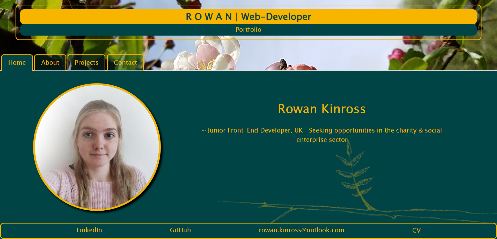

# Rowan Kinross - Web Developer Portfolio

## Project Status
on pause, for now.

## Description
'Rowan Kinross - Web Developer Portfolio' is a web-application project aiming to create a polished portfolio page to display a selection of my best projects and my contact details for use in a professional setting, such as job searching and networking. The aim of the project was to take what I have learned in react so far, such as react router dom for the nav-tabs and react's hooks, state setting and folder organisation, and create a web-application which both tests my understanding and works as a useful tool for my next steps in web-development. Users can easily find information about me, my skillset, my motives and brand-statement and links to my social media, email and projects. The project makes use of react (react-router, hooks, state-setting, props), html, css, bootstrap, JSON, javascript and netlify.   
https://rkinross-web-dev-portfolio.netlify.app/
  
## Table of Contents
[Project Status](https://github.com/RowanKinross/rkinross_webdev_portfolio?tab=readme-ov-file#project-status)  
[Description](https://github.com/RowanKinross/rkinross_webdev_portfolio?tab=readme-ov-file#description)  
[Installation](https://github.com/RowanKinross/rkinross_webdev_portfolio?tab=readme-ov-file#installation)  
[Usage](https://github.com/RowanKinross/rkinross_webdev_portfolio?tab=readme-ov-file#usage)  
[Demo](https://github.com/RowanKinross/rkinross_webdev_portfolio?tab=readme-ov-file#demo)  
[License](https://github.com/RowanKinross/rkinross_webdev_portfolio?tab=readme-ov-file#license)  
[Contributors](https://github.com/RowanKinross/rkinross_webdev_portfolio?tab=readme-ov-file#contributors)  
[Credits](https://github.com/RowanKinross/rkinross_webdev_portfolio?tab=readme-ov-file#credits)  
[Tests](https://github.com/RowanKinross/rkinross_webdev_portfolio?tab=readme-ov-file#tests)  
[Questions](https://github.com/RowanKinross/rkinross_webdev_portfolio?tab=readme-ov-file#questions)
  
## Installation
n/a

## Usage
Upon opening the project, the user is met with a home page, displaying a headshot of me, plus my brand-statement. The user can then navigate through the nav-tabs to find out more about me. On the 'about' page the user can find more in depth information about why I have decided to change careers, what drives me and what I am looking to achieve. The 'projects' tab displays six of my key-projects, with a screenshot of each deployed application, a link to the github repo and a link to the deployed page where possible. The 'contact' page contains a form which can be filled out by the user for getting in touch and the information is passed through an email-generator API so that it automatically sends to my email. If the fields are left empty, the user is prompted to fill them in fully. Finally, links can be found in the footer for my linkedIn, github, email and up-to-date CV (in pdf format).

## Demo

Mobile demo screencapture:  
 

Desktop demo screencapture:  
 

Mobile & desktop demo gif:  

## License
MIT License

## Contributors
n/a

## Credits
edX for giving me the skills to take on this challenge, emailjs.com for the email automatic generator API.

## Tests
n/a

## Questions
If you have any further questions you can find me here:  
GitHub - https://github.com/RowanKinross  
Email - rowan.kinross@outlook.com 